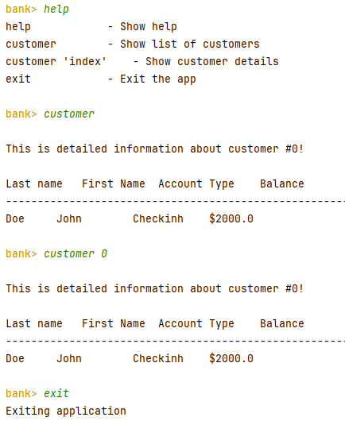
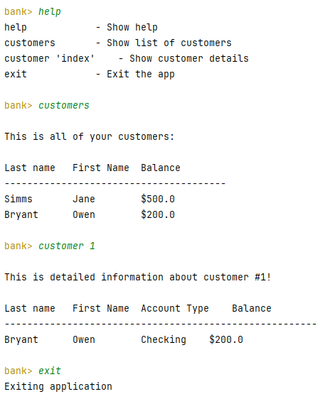
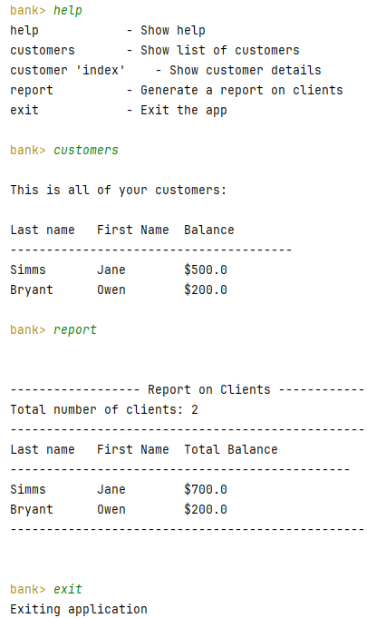

# UI Lab 2 
```Task3.png:```



```Task4.png:```



```Task5.png:```




```CLIdemo.java:```
```java
package com.mybank.tui;

import com.mybank.domain.Bank;
import com.mybank.domain.CheckingAccount;
import com.mybank.domain.Customer;
import com.mybank.domain.SavingsAccount;

import java.io.BufferedReader;
import java.io.FileReader;
import java.io.IOException;
import java.io.PrintWriter;
import java.util.LinkedList;
import java.util.List;
import org.jline.reader.*;
import org.jline.reader.impl.completer.*;
import org.jline.utils.*;
import org.fusesource.jansi.*;

public class CLIdemo {

    public static final String ANSI_RESET = "\u001B[0m";
    public static final String ANSI_RED = "\u001B[31m";
    public static final String ANSI_GREEN = "\u001B[32m";
    public static final String ANSI_YELLOW = "\u001B[33m";

    private String[] commandsList;

    public void init() {
        commandsList = new String[]{"help", "customers", "customer", "report", "exit"};
        loadCustomersFromFile("test.dat");
    }

    private void loadCustomersFromFile(String filename) {
        try (BufferedReader br = new BufferedReader(new FileReader(filename))) {
            int numberOfCustomers = Integer.parseInt(br.readLine().trim());
            for (int i = 0; i < numberOfCustomers; i++) {
                String customerLine = br.readLine().trim();
                String[] customerData = customerLine.split("\t");
                if (customerData.length < 3) {
                    System.out.println(ANSI_RED + "Error: Invalid customer data format" + ANSI_RESET);
                    continue;
                }

                String firstName = customerData[0];
                String lastName = customerData[1];
                int numberOfAccounts = Integer.parseInt(customerData[2]);

                Bank.addCustomer(firstName, lastName);
                Customer customer = Bank.getCustomer(Bank.getNumberOfCustomers() - 1);

                for (int j = 0; j < numberOfAccounts; j++) {
                    String accountLine = br.readLine().trim();
                    String[] accountData = accountLine.split("\t");
                    if (accountData.length < 3) {
                        System.out.println(ANSI_RED + "Error: Invalid account data format" + ANSI_RESET);
                        continue;
                    }

                    String accountType = accountData[0];
                    double balance = Double.parseDouble(accountData[1]);

                    if (accountType.equals("C")) { // Checking Account
                        double overdraftProtection = Double.parseDouble(accountData[2]);
                        customer.addAccount(new CheckingAccount(balance, overdraftProtection));
                    } else if (accountType.equals("S")) { // Savings Account
                        double interestRate = Double.parseDouble(accountData[2]);
                        customer.addAccount(new SavingsAccount(balance, interestRate));
                    }
                }
            }
        } catch (IOException | NumberFormatException e) {
            System.out.println(ANSI_RED + "Error reading file: " + e.getMessage() + ANSI_RESET);
        }
    }

    public void run() {
        AnsiConsole.systemInstall();
        printWelcomeMessage();
        LineReaderBuilder readerBuilder = LineReaderBuilder.builder();
        List<Completer> completors = new LinkedList<>();
        completors.add(new StringsCompleter(commandsList));
        readerBuilder.completer(new ArgumentCompleter(completors));
        LineReader reader = readerBuilder.build();
        String line;
        PrintWriter out = new PrintWriter(System.out);

        while ((line = readLine(reader, "")) != null) {
            if ("help".equals(line)) {
                printHelp();
            } else if ("customers".equals(line)) {
                printCustomers();
            } else if (line.startsWith("customer")) {
                handleCustomerCommand(line);
            } else if ("report".equals(line)) {
                generateReport();
            } else if ("exit".equals(line)) {
                System.out.println("Exiting application");
                return;
            } else {
                System.out.println(ANSI_RED + "Invalid command, For assistance press TAB or type \"help\" then hit ENTER." + ANSI_RESET);
            }
        }

        AnsiConsole.systemUninstall();
    }

    private void printWelcomeMessage() {
        System.out.println("\nWelcome to " + ANSI_GREEN + " MyBank Console Client App" + ANSI_RESET + "! \nFor assistance press TAB or type \"help\" then hit ENTER.");
    }

    private void printHelp() {
        System.out.println("help\t\t\t- Show help");
        System.out.println("customers\t\t- Show list of customers");
        System.out.println("customer 'index'\t- Show customer details");
        System.out.println("report\t\t\t- Generate a report on clients");
        System.out.println("exit\t\t\t- Exit the app");
    }

    private String readLine(LineReader reader, String promptMessage) {
        try {
            String line = reader.readLine(promptMessage + ANSI_YELLOW + "\nbank> " + ANSI_RESET);
            return line.trim();
        } catch (UserInterruptException e) {
            return null;
        } catch (EndOfFileException e) {
            return null;
        }
    }

    private void printCustomers() {
        AttributedStringBuilder a = new AttributedStringBuilder()
                .append("\nThis is all of your ")
                .append("customers", AttributedStyle.BOLD.foreground(AttributedStyle.RED))
                .append(":");
        System.out.println(a.toAnsi());
        if (Bank.getNumberOfCustomers() > 0) {
            System.out.println("\nLast name\tFirst Name\tBalance");
            System.out.println("---------------------------------------");
            for (int i = 0; i < Bank.getNumberOfCustomers(); i++) {
                Customer customer = Bank.getCustomer(i);
                System.out.println(customer.getLastName() + "\t\t" + customer.getFirstName() + "\t\t$" + customer.getAccount(0).getBalance());
            }
        } else {
            System.out.println(ANSI_RED + "Your bank has no customers!" + ANSI_RESET);
        }
    }

    private void handleCustomerCommand(String line) {
        try {
            int custNo = 0;
            if (line.length() > 8) {
                String strNum = line.split(" ")[1];
                if (strNum != null) {
                    custNo = Integer.parseInt(strNum);
                }
            }
            Customer cust = Bank.getCustomer(custNo);
            String accType = cust.getAccount(0) instanceof CheckingAccount ? "Checking" : "Savings";

            AttributedStringBuilder a = new AttributedStringBuilder()
                    .append("\nThis is detailed information about customer #")
                    .append(Integer.toString(custNo), AttributedStyle.BOLD.foreground(AttributedStyle.RED))
                    .append("!");

            System.out.println(a.toAnsi());

            System.out.println("\nLast name\tFirst Name\tAccount Type\tBalance");
            System.out.println("-------------------------------------------------------");
            for (int i = 0; i < cust.getNumberOfAccounts(); i++) {
                String accountType = cust.getAccount(i) instanceof CheckingAccount ? "Checking" : "Savings";
                System.out.println(cust.getLastName() + "\t\t" + cust
                        .getFirstName() + "\t\t" + accountType + "\t$" + cust.getAccount(i).getBalance());
            }
        } catch (Exception e) {
            System.out.println(ANSI_RED + "ERROR! Wrong customer number!" + ANSI_RESET);
        }
    }
    private void generateReport() {
        System.out.println("\n\n------------------ Report on Clients ------------------");
        System.out.println("Total number of clients: " + Bank.getNumberOfCustomers());
        System.out.println("-------------------------------------------------------");
        if (Bank.getNumberOfCustomers() > 0) {
            System.out.println("Last name\tFirst Name\tTotal Balance");
            System.out.println("-----------------------------------------------");
            for (int i = 0; i < Bank.getNumberOfCustomers(); i++) {
                Customer customer = Bank.getCustomer(i);
                double totalBalance = 0;
                for (int j = 0; j < customer.getNumberOfAccounts(); j++) {
                    totalBalance += customer.getAccount(j).getBalance();
                }
                System.out.println(customer.getLastName() + "\t\t" + customer.getFirstName() + "\t\t$" + totalBalance);
            }
        } else {
            System.out.println(ANSI_RED + "Your bank has no customers!" + ANSI_RESET);
        }
        System.out.println("-------------------------------------------------------\n");
    }

    public static void main(String[] args) {
        CLIdemo shell = new CLIdemo();
        shell.init();
        shell.run();
    }
}
```
